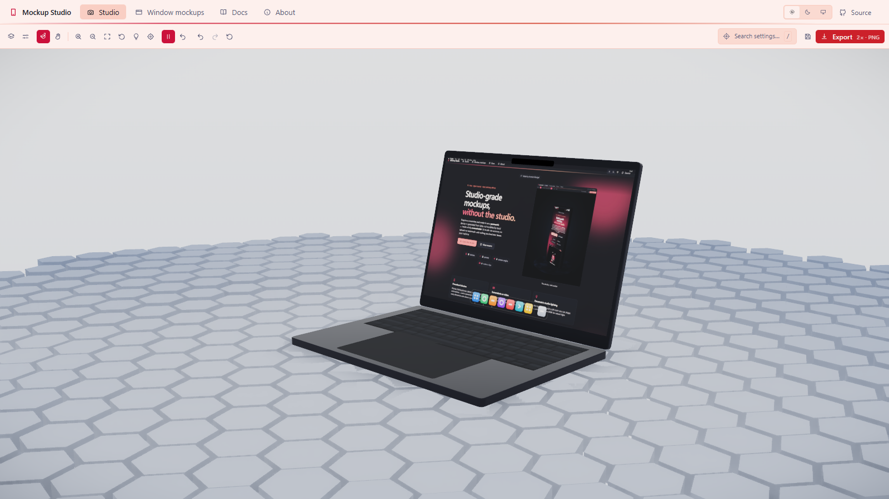

# Mockup Studio

**A free, open-source, fully-local 3D mockup generator for websites and apps.**

<p>
  <a href="https://mockup-studio.anahatmudgal.com">
    
  </a>
  <a href="https://github.com/AnahatM/MockupStudio">
    
  </a>
  <a href="https://github.com/AnahatM/MockupStudio/issues">
    
  </a>
  <a href="https://github.com/AnahatM/MockupStudio/issues">
    
  </a>
  <a href="LICENSE">
    
  </a>
</p>

Drop in a screenshot or a screen recording and Mockup Studio renders it on a real
device — phone, folding phone, tablet, laptop, desktop or watch — inside a
customizable 3D studio with parametric lighting, backdrops, camera angles and
motion, then exports a still or a video. No watermark, no account, no upload:
the whole app, and every file you give it, stays on your machine.

**Try it: [mockup-studio.anahatmudgal.com](https://mockup-studio.anahatmudgal.com)**

<p align="center">
  
</p>

---

## Why it exists

Most mockup generators are a hosted SaaS: you upload your screenshot to someone
else's server, wait for a render, and hope the free tier doesn't watermark it.
Mockup Studio is the opposite bet — **everything happens in your browser**.
Device bodies are generated from parametric data rather than downloaded 3D
files, studio lighting is built from math rather than a fetched HDRI, and your
screenshot never leaves the tab it was dropped into. There is no server in this
project at all.

Because every device is data rather than a baked model, nothing about it is
fixed — colour, finish, dimensions and details are all live controls, and
adding a whole new device to the catalogue is normally a single small file.

## Features

- **Real 3D, fully orbittable.** Drag to orbit, right- or middle-drag to pan,
  scroll to zoom — plus a free-fly navigation mode. This is a real scene, not a
  flat image with a perspective transform.
- **15 procedural devices.** Phones, notch-era phones, an Android flagship,
  folding and flip phones, tablets, laptops, an all-in-one desktop, a monitor
  and two watch shapes — each generated from a millimetre-accurate spec file,
  complete with Dynamic Islands/notches, camera bumps with real lenses, side
  buttons, stands and watch straps.
- **Screenshots or screen recordings.** Images (PNG, JPG, WebP, AVIF, GIF, SVG)
  and video (MP4, WebM, OGG, MOV) both play directly on the device screen, with
  cover/contain/stretch fitting, zoom and pan.
- **Toggleable OS chrome.** Status bar (time, carrier, signal, wifi, battery),
  gesture bar, Android nav buttons, and macOS menu bar and dock — each is an
  independent texture layer, so it works identically on every device and costs
  nothing when it's off.
- **10 procedural materials.** Brushed titanium, aluminium and steel, anodised
  aluminium, polished metal, matte and glossy glass, ceramic, and soft-touch or
  glossy plastic — set independently for a device's frame and back, plus a
  separate glossy/matte choice for the screen glass.
- **Brand colour matching.** A local, dependency-free median-cut palette
  extractor reads the dominant colours out of your upload so you can apply them
  to the backdrop glow, rim lights, device body or plinth in one click.
- **Parametric studio lighting.** Seven lighting rigs (Studio, Rim glow, Soft
  box, Dramatic, Neon, Product white, Moody), up to eight fully manual lights,
  an ambient "room" fill, and local `.hdr`/`.exr` environment map loading — no
  CDN HDRIs.
- **9 camera angle presets** — Front, Hero, Three-quarter, Low hero, Top down,
  Floating, Dutch, Macro detail and Profile — computed as spherical offsets, so
  they compose correctly on a watch and a 27" monitor alike.
- **Parametric backdrops.** Transparent, solid, gradient, radial glow,
  cyclorama or grid.
- **Animation and video export.** 8 motion clips (Turntable, Camera orbit,
  Float, Breathe, Sway, Tilt in, Pop in, Parallax reveal) with duration,
  amount and easing controls, recorded straight to WebM (VP9/VP8) via
  `MediaRecorder` — no encoder to install.
- **PNG export at any resolution**, independent of your browser window size,
  with platform size presets (App Store, Play Store, iPad, OG image, X card,
  Dribbble, Product Hunt, 4K, custom) and a genuinely transparent-background
  mode.
- **2D window mockups.** macOS and browser chrome with traffic lights, tabs, a
  URL bar and a customizable, colour-matched title bar — export it flat as a
  PNG, or show it on a laptop screen inside the 3D scene.
- **12 built-in presets** across studio, dramatic, flat and motion looks, plus
  save/load/rename in your browser's local storage and export/import as one
  versioned, shareable JSON manifest.
- **Light and dark "chalk" theme** — a quiet, near-shadowless UI that stays out
  of the way of the render.

## Built with

<p>
  
  
  
  
  
  
  
  
  
</p>

React 19.2 · Vite 8 (Rolldown) · TypeScript 6 · three.js 0.185 · React Three
Fiber 9 · drei 10 · postprocessing · Zustand 5 + Immer · Zod 4 · CSS Modules ·
Vitest.

## Getting started

### Prerequisites

- Node **20.19+** or **22.12+**
- npm

### Install

```bash
git clone https://github.com/AnahatM/MockupStudio.git
cd MockupStudio
npm install
```

### Run

```bash
npm run dev
```

Open the printed local URL — the studio is at `/studio`.

### Build

```bash
npm run build      # typecheck, generate the sitemap, then build for production
npm run preview     # serve the production build locally
```

### Verify

```bash
npm run verify      # typecheck + eslint + stylelint + vitest, in order
```

| Script               | Purpose                                            |
| -------------------- | --------------------------------------------------- |
| `npm run dev`         | Start the dev server                                |
| `npm run build`       | Typecheck, build the sitemap, then production build |
| `npm run preview`      | Preview the production build                        |
| `npm run typecheck`    | TypeScript only                                     |
| `npm run lint`         | ESLint, including the file-length limits             |
| `npm run lint:css`     | Stylelint, including the no-hardcoded-colour rule    |
| `npm run test`         | Unit tests (Vitest)                                 |
| `npm run verify`       | All checks above, in order                          |
| `npm run format`       | Prettier, write mode                                |

## Project structure

```
src/
├─ app/          Layout, routing, pages and schema-driven control panels
├─ features/     Domain slices — devices, scene, lighting, camera, animation,
│                capture, screen, flat (2D windows), media, presets, theme
├─ state/        Zustand store, one slice per domain, composed with Immer
├─ ui/           Design-system primitives and the schema-driven ControlList
├─ lib/          Pure, React-free functions — geometry math, colour, result
│                types — the only place genuinely tricky logic is allowed
├─ styles/       Three-tier CSS custom-property token system
└─ content/      The in-app documentation you're reading a summary of here
```

Dependencies point downward only (`app → features → state → ui → lib`), and a
control is a typed data entry in a panel schema, never hand-written JSX — see
[`docs/reference/architecture.md`](docs/reference/architecture.md) for the full
picture, including why lighting is built from math instead of an HDRI and why
device geometry is procedural instead of a bundled 3D model.

## Documentation

- [`docs/reference/architecture.md`](docs/reference/architecture.md) — layering and cross-cutting decisions
- [`docs/reference/design-tokens.md`](docs/reference/design-tokens.md) — the theming system
- [`docs/reference/device-specs.md`](docs/reference/device-specs.md) — how a device spec is structured
- [`docs/reference/preset-manifest.md`](docs/reference/preset-manifest.md) — the shareable scene file format
- [`docs/adr/`](docs/adr/) — architecture decision records, with the reasoning behind each one
- [`src/content/docs/articles/quick-start.md`](src/content/docs/articles/quick-start.md) — the in-app user guide's starting page (also readable live at `/docs` in the running app)

## Roadmap

Every phase is independently useful — the studio has been usable since phase 2,
and each later phase adds a capability rather than finishing a half-built one.

| Phase | Ships | Status |
| --- | --- | --- |
| Foundation | Design tokens, control system, app shell | Complete |
| Studio | Parametric lighting, backdrops, pedestal, postprocessing | Complete |
| Devices | Procedural device system, 15 devices, materials | Complete |
| Media | Screenshots and video on the device screen, brand-colour extraction | Complete |
| Overlays | Status bars, gesture bars, menu bars, docks | Complete |
| Output | PNG export at any size, WebM recording, preset manifest | Complete |
| Site | Landing page, 17-article manual, search, sitemap | Complete |
| 2D mockups | macOS and browser chrome, container styles, shadow presets | Complete |
| Import | GLB/GLTF models with their own materials | Complete |
| Composition | Multi-device App Store layouts with headline text | In progress |
| Environments | Structured 3D backdrops and procedural surface textures | In progress |

## Known limitations

Stated plainly, because a feature list that omits what does not work is not a
feature list.

- **Video exports are WebM only.** `MediaRecorder` cannot produce MP4 in the
  browser, and MP4 would need a WebCodecs path. WebM is not accepted by every
  upload target, App Store Connect among them.
- **Transparent video is not possible today.** `canvas.captureStream()`
  composites to opaque RGB before the recorder ever sees it, so alpha is lost
  before encoding. Transparent *stills* work fine.
- **Screen overlays do not composite onto an imported GLB model.** The status
  bar and gesture bar are texture layers positioned against a known screen
  geometry; an imported model's screen mesh has an arbitrary orientation.
  Procedural devices are unaffected.
- **Draco-compressed GLB files are unsupported.** The usual decoder is fetched
  from a CDN on first use, which would break the fully-local promise. Export
  your model uncompressed.
- **Glass and inset container styles are approximations.** Canvas 2D has no
  backdrop-filter, and the compositor also paints the device-screen texture,
  which cannot see what is behind it in the 3D scene.
- **First render can be slow on low-end hardware.** The postprocessing stack
  compiles several shaders on first paint. A loading indicator covers it, but
  it is genuinely slower on integrated graphics.

## Contributing

Contributions are welcome — see [`CONTRIBUTING.md`](CONTRIBUTING.md). Adding a
device is deliberately the easiest way in: it's normally one data file plus a
one-line registry entry.

Three rules are enforced by tooling rather than review: no hardcoded CSS
colours outside `src/styles/tokens/`, a 150-line-per-file / 80-line-per-function
limit, and strict TypeScript with no `any`. `npm run verify` checks all of it
before you open a PR.

## Licence

[MIT](LICENSE).

**No device manufacturer is affiliated with or endorses this project.** Every
device is an original procedural approximation generated from published outside
dimensions — there is not a single downloaded or traced model in the repository,
which is one of the reasons it works that way (see
[ADR 0001](docs/adr/0001-procedural-geometry.md)). Catalogue names describe a
form factor rather than a product: "Pro Phone 6.1"", "Flip (open)", "All-in-one
24"".

The screenshots on the devices in this repo's own images are **this app's own
pages**, captured by `npm run shots`. That is deliberate: a mockup tool
advertising itself with somebody else's product UI is a problem no licence
fixes, and if you contribute an image please do the same rather than pasting a
real product's interface.

---

## Author

**Anahat Mudgal**

<p>
  <a href="https://anahatmudgal.com">
    
  </a>
  <a href="https://github.com/anahatm">
    
  </a>
  <a href="https://anahat-mudgal.medium.com/">
    
  </a>
  <a href="https://x.com/AnahatMudgal">
    
  </a>
  <a href="https://bsky.app/profile/anahat.bsky.social">
    
  </a>
  <a href="https://www.youtube.com/@AnahatMudgal">
    
  </a>
</p>
